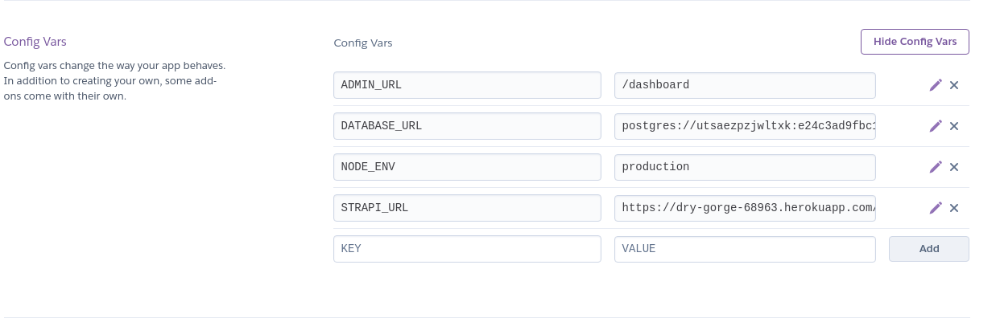

# Test app

This is a test Strapi application deployed to Heroku and using the Environment Configurations to modify the root URL and the admin panel URL.

Environment Variables used in Heroku:



```
=== dry-gorge-68963 Config Vars
ADMIN_URL:    /dashboard
DATABASE_URL: postgres://-snip-
NODE_ENV:     production
STRAPI_URL:   https://dry-gorge-68963.herokuapp.com/
```
